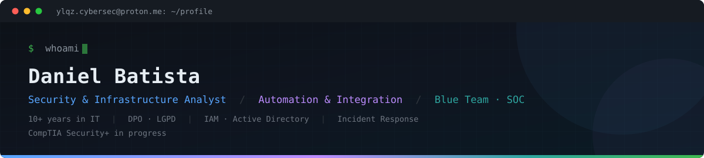

<p align="center">
  
</p>

<p align="center">
  <a href="https://www.linkedin.com/in/danielbatista/">
    
  </a>
  <a href="https://ylitsolutions.com.br/">
    
  </a>
  <a href="mailto:ylqz.cybersec@proton.me">
    
  </a>
</p>

---

## What I do

**Security &amp; Compliance:** Data Protection Officer (DPO) under the Brazilian
LGPD framework: risk assessment, data mapping, incident response procedures and
vendor due diligence.

**Identity &amp; Access Management:** Active Directory and IAM administration across
a multi-tool environment: provisioning, access reviews, least-privilege enforcement
and offboarding controls.

**Automation &amp; Integration:** production workflows in n8n, Python, Google Apps
Script and PowerShell, connecting internal systems, ticketing and reporting pipelines.

**Infrastructure:** Linux and Windows administration, networking, VPN, firewalls
and endpoint management.

---

## Currently

```diff
+ Studying for CompTIA Security+ (SY0-701)
+ Building a defensive security lab portfolio: detection, log analysis, incident triage
+ Improving technical English for international remote work
```

---

## Stack

<p>
  
</p>

| Area | Tools |
|---|---|
| **Security** | Active Directory / IAM, VPN, firewalls, IDS/IPS, ISO/IEC 27001 exposure |
| **Automation** | n8n, Python, JavaScript, Google Apps Script, Webhooks, Docker |
| **Systems** | Linux, Windows Server, PowerShell, Bash |
| **Data** | SQL, JSON, Looker, Power BI |
| **Governance** | LGPD, risk matrix, access review, asset inventory |

---

## Selected work

### [cyber-knowledge-hub](https://github.com/augusto-cesar-dsr/cyber-knowledge-hub)

Collaborative cybersecurity knowledge base built as an academic group project.
Contributed to content structure and the practical labs section.

  

### [pdf-attachment-dispatcher](https://github.com/yl-dan/pdf-attachment-dispatcher)

Google Apps Script web app that fetches remote PDFs and dispatches them as email
attachments. Built with shared-secret authentication, SSRF protection via source
allowlist, and recipient allowlisting to prevent relay abuse.

 

### [cnpj-enricher](https://github.com/yl-dan/cnpj-enricher)

Vendor due diligence tool that enriches a spreadsheet of Brazilian company
registrations with public Receita Federal records. Resumable batch processing,
rate-limit aware retries, and automatic risk flagging for inactive registrations
and judicial recovery.

  

### [windows-maintenance-toolkit](https://github.com/yl-dan/windows-maintenance-toolkit)

Interactive batch menu for routine workstation maintenance and network diagnostics,
built entirely on native Windows utilities, with no remote code execution and no
third-party binaries.

 

### [usd-brl-converter](https://github.com/yl-dan/usd-brl-converter)

Currency conversion with Brazilian IOF tax calculation, using `Decimal` arithmetic
for accurate financial rounding.

 

---

## Education &amp; involvement

```console
2026     Cybersecurity Technologist (CST)     IPOG
2024 →   Committee member                     Instituto de Defesa Cibernetica
```
